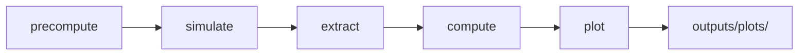

# Delta Yatzy

Optimal Scandinavian Yatzy solver with risk-sensitive play. Uses dynamic programming to precompute expected values for all 2M+ game states, a risk parameter θ for tunable risk preference, and a web UI for real-time strategy advice.

## Quick Start

```bash
# Install just (task runner): brew install just
just setup          # Build solver + install analytics
just precompute     # Precompute EV table (~2.3s)
just serve          # API server on :9000
just test           # Run solver tests
just test-all       # All tests (solver + frontend + analytics)
just check          # Full quality gate (lint + typecheck + test + bench)
just --list         # See all recipes
```

## Pipeline



```bash
just precompute                 # θ=0 strategy table → data/strategy_tables/
just simulate                   # 1M games → data/simulations/
just pipeline                   # extract → compute → plot → outputs/
```

## Project Structure

```
yatzy/
├── solver/             Rust DP solver + API server + simulation engine
├── analytics/          Python package for analysis, KDE, plotting
├── frontend/           Vanilla TypeScript + D3.js game UI
├── theory/             Strategy docs and analytical insights
├── data/               Strategy tables (~300MB) + simulation data (~11GB)
│   ├── strategy_tables/    Precomputed EV tables (all_states*.bin)
│   └── simulations/        Raw simulation binaries
├── outputs/            Regenerable aggregates, plots, scenarios
├── configs/            Theta grids and simulation defaults
├── research/rl/        Archived RL experiments
├── legacy/             Legacy C implementation (reference only)
├── justfile            Task runner recipes
└── docker-compose.yml  Containerized deployment
```

## API

```bash
curl "http://localhost:9000/state_value?upper_score=50&scored_categories=3"

curl -X POST http://localhost:9000/evaluate \
  -H "Content-Type: application/json" \
  -d '{"dice":[1,3,3,4,6],"upper_score":10,"scored_categories":5,"rerolls_remaining":2}'
```

## Key Details

- **Scandinavian Yatzy**: 15 categories, 50-point upper bonus (not 35)
- **State space**: upper_score (0-63) x scored_categories (15-bit) = 2,097,152 states
- **Storage**: ~8 MB binary, zero-copy mmap loading in <1ms
- **Risk parameter θ**: exponential utility u(x) = e^(θx). θ=0 is EV-optimal, θ<0 risk-averse, θ>0 risk-seeking
- **Precompute**: ~2.3s for θ=0 (Apple Silicon, 8 threads)
